# Storybook Storyblok Addon (storybook-storyblok-addon)

[](https://www.npmjs.com/package/storybook-storyblok-addon)
[](https://opensource.org/licenses/MIT)

A Storybook addon that enables copying component blocks from Storybook and pasting them directly into the Storyblok visual editor. Perfect for design teams who want to quickly add pre-configured components to their Storyblok pages.

## Features

- **One-Click Copy**: Copy component block data from any Storybook story
- **Visual Editor Integration**: Paste blocks directly into Storyblok's Body, Header, or Footer sections
- **Automatic Field Population**: Props from your story are automatically mapped to Storyblok block fields
- **Bookmarklet Bridge**: Simple bookmarklet handles the clipboard-to-Storyblok transfer
- **Panel UI**: View component documentation, props, and JSON preview before copying

## How It Works

```mermaid
graph LR
    A[Storybook<br/>Click 📋<br/>Copy Button] -->|Copy JSON| B[Bookmarklet<br/>Click in<br/>Storyblok]
    B -->|Transfer| C[Storyblok<br/>Paste Block<br/>appears!]
    
    style A fill:#ff4785,stroke:#333,stroke-width:2px,color:#fff
    style B fill:#09b3af,stroke:#333,stroke-width:2px,color:#fff
    style C fill:#00b3b0,stroke:#333,stroke-width:2px,color:#fff
```



1. **Copy** a block from Storybook (copies JSON to system clipboard)
2. **Click** the bookmarklet while on Storyblok (transfers to Storyblok's internal clipboard)
3. **Paste** the block into any "bloks" field (Body, Header, Footer, etc.)

## Installation

```bash
npm install storybook-storyblok-addon --save-dev
```

## Quick Start

### Step 1: Add to Storybook

Add the addon to your `.storybook/main.js` or `.storybook/main.ts`:

```javascript
module.exports = {
  addons: [
    '@storybook/addon-essentials',
    'storybook-storyblok-addon',
  ],
}
```

### Step 2: Install the Bookmarklet

1. Open Storybook and navigate to any component story
2. Open the **"Storyblok"** panel (bottom tabs)
3. Find the **"Paste to Storyblok"** button
4. **Drag** it to your browser's bookmarks bar

### Step 3: Copy & Paste Workflow

1. In Storybook, navigate to the component you want to copy
2. Click the **📋 Copy** button in the toolbar (or use the panel's copy button)
3. Go to your Storyblok page editor
4. Click the **bookmarklet** in your bookmarks bar
5. You'll see a success message: "✅ 1 block(s) ready to paste!"
6. Click on a "bloks" field (Body, Header, Footer) and select **"Paste Block"**

## Usage for Developers

### Basic Story Setup

The addon automatically extracts props from your stories. No special configuration required:

```javascript
// Button.stories.js
import BaseButton from '~/components/storyblok/BaseButton.vue'

export default {
  title: 'Storyblok/Buttons/BaseButton',
  component: BaseButton,
  argTypes: {
    label: { control: 'text' },
    url: { control: 'text' },
    classes: { control: 'text' },
  },
}

export const Primary = {
  args: {
    label: 'Get Started',
    url: '#signup',
    classes: 'mv-btn--primary',
  },
}
```

When you copy the "Primary" story, it generates:

```json
[
  {
    "id": "",
    "_uid": "a1b2c3d4-...",
    "component": "BaseButton",
    "label": "Get Started",
    "url": "#signup",
    "classes": "mv-btn--primary"
  }
]
```

### Advanced: Custom Storyblok Configuration

Override the default behavior with `storyblok` parameters:

```javascript
export default {
  title: 'Components/HeroSection',
  component: HeroSection,
  parameters: {
    storyblok: {
      // Use a different component name in Storyblok
      blockName: 'hero_section',
      
      // Custom field mappings
      fieldMappings: {
        backgroundImage: { type: 'asset', filetypes: ['images'] },
        ctaButtons: { type: 'bloks', restrict_components: true },
      },
    },
  },
}
```

### Component Name Mapping

The addon preserves your component name as-is (PascalCase). If your Storyblok component has a different name:

```javascript
parameters: {
  storyblok: {
    blockName: 'my_custom_button', // Overrides component name
  },
}
```

## Important: Component Must Exist in Storyblok

The paste will only work if the component already exists in your Storyblok space's Block Library.

For example, if you copy a `BaseButton` from Storybook, you must have a component named `BaseButton` in Storyblok with matching fields.

**If you get "Oops, the component was not found":**
1. Check your Storyblok Block Library for the exact component name
2. Either create the component in Storyblok, or
3. Use `blockName` parameter to map to an existing component

## Troubleshooting

### "Clipboard does not contain valid JSON"

- Make sure you clicked the copy button in Storybook first
- The copy must happen within a few seconds before clicking the bookmarklet
- Check that Storybook didn't show an error when copying

### "Paste Block" option doesn't appear

1. Click on a different field in Storyblok, then click back
2. Make sure you clicked the bookmarklet after copying
3. Try refreshing the Storyblok page and running the bookmarklet again

### "Oops, the component was not found"

The component name in the copied block doesn't exist in your Storyblok space:

1. Go to Storyblok → Block Library
2. Check if a component with that exact name exists
3. Either create the component or use `blockName` parameter to map to an existing one

### Bookmarklet permission error

- The bookmarklet needs clipboard read permission
- Chrome/Edge: Allow clipboard access when prompted
- Firefox: May need to enable `dom.events.asyncClipboard.readText` in about:config

## How the Addon Works (Technical Details)

### Generated Block Format

The addon generates Storyblok block instances in this format:

```json
[
  {
    "id": "",
    "_uid": "unique-uuid-v4",
    "component": "ComponentName",
    "prop1": "value1",
    "prop2": "value2"
  }
]
```

- `id`: Empty string (Storyblok fills this on save)
- `_uid`: Unique identifier (UUID v4)
- `component`: Component name (must match Storyblok Block Library)
- `...props`: All props from your story's `args`

### Bookmarklet Flow

1. Reads JSON from system clipboard (`navigator.clipboard.readText()`)
2. Validates the JSON structure (must have `_uid` and `component`)
3. Writes to `localStorage.setItem('clipboard', json)`
4. Dispatches events to trigger Storyblok's UI update

### Field Type Mapping

| Storybook Control | Storyblok Field |
|-------------------|-----------------|
| `text` | `text` |
| `boolean` | `boolean` |
| `number` | `number` |
| `select` | `option` |
| `multi-select` | `options` |
| `color` | `colorpicker` |
| `date` | `datetime` |
| `object` | `bloks` |
| `array` | `bloks` |
| `file` | `asset` |

## Project Structure

```
src/
├── Tool.tsx              # Toolbar copy button
├── Panel.tsx             # Panel UI with documentation & JSON preview
├── bookmarklet.ts        # Bookmarklet code for Storyblok transfer
├── index.ts              # Addon registration
├── preset.ts             # Storybook preset config
└── utils/
    ├── extractMetadata.ts      # Extract component info from stories
    ├── generateBlockInstance.ts # Generate Storyblok block JSON
    ├── fieldMapper.ts          # Map Storybook controls to Storyblok fields
    ├── generateStoryblokJSON.ts # Generate component schemas
    └── clipboard.ts            # Clipboard API utilities
```

## Development

```bash
# Install dependencies
npm install

# Start Storybook dev server
npm run storybook

# Build the addon
npm run build

# Type check
npm run type-check
```

## Browser Compatibility

- Chrome/Edge 90+
- Firefox 88+
- Safari 14.1+

Requires modern Clipboard API. Falls back to `execCommand` for basic copy operations.

## Documentation

- [Quick Start Guide](docs/QUICK_START.md) - Get started in 5 minutes
- [Testing Plan](docs/TESTING_PLAN.md) - Comprehensive testing guide
- [Architecture](docs/ARCHITECTURE.md) - Technical implementation details
- [Proposal](docs/PROPOSAL.md) - Original design proposal

## Contributing

Contributions are welcome! Please read our [Contributing Guide](docs/CONTRIBUTING.md) for details on how to submit pull requests, report issues, and contribute to the project.

Please note that this project is released with a [Code of Conduct](CODE_OF_CONDUCT.md). By participating in this project you agree to abide by its terms.

## Changelog

See [CHANGELOG.md](CHANGELOG.md) for a history of changes to this project.

## Support

For issues and feature requests, please visit:
https://github.com/mazemax/storybook-storyblok-addon/issues

## License

MIT © Max Saad

See [LICENSE](LICENSE) for more information.
