# Storybook Addon: Copy Component to Storyblok
## Implementation Proposal

---

## Executive Summary

This proposal outlines a **Storybook addon** that enables your team to:
1. **View component documentation** directly in Storybook
2. **Copy component metadata** with a single click
3. **Paste into Storyblok** with pre-filled block configuration
4. **Manage component variants** and props dynamically

The addon bridges your design system (Storybook) with your CMS (Storyblok), reducing friction for non-technical content creators while maintaining component consistency.

---

## Core Architecture

### 1. **Addon Type: Panel + Toolbar**

**Why?** You need both:
- **Toolbar Button**: Quick access to copy functionality
- **Panel Tab**: Display component metadata, props schema, and instructions

**Entry Points:**
```typescript
src/
├── Tool.tsx          // Toolbar button with copy icon
├── Panel.tsx         // Side panel showing component info
├── index.ts          // Manager registration
├── withGlobals.ts    // Story decorator for metadata injection
└── utils/
    ├── extractMetadata.ts
    ├── generateStoryblokJSON.ts
    └── clipboard.ts
```

---

## 2. **Key Features to Implement**

### Feature A: Component Metadata Extraction
**Goal:** Automatically extract component props, documentation, and stories from Storybook

```typescript
// Extract from story metadata
const extractComponentMetadata = (storyContext) => {
  return {
    componentName: storyContext.component.__name,
    description: storyContext.parameters.docs?.description?.component,
    props: storyContext.argTypes,
    variants: storyContext.parameters.variants || [],
    stories: Object.keys(storyContext.stories),
    designTokens: storyContext.parameters.designTokens || {}
  }
}
```

**What to capture:**
- Component name & description
- PropTypes / TypeScript interface
- Available stories/variants
- Default props
- Controls & their types
- Usage guidelines
- Links to Figma (if in story metadata)

---

### Feature B: Storyblok JSON Generator
**Goal:** Convert Storybook metadata into Storyblok block JSON format

```typescript
// Generate Storyblok-compatible block schema
const generateStoryblokSchema = (metadata) => {
  return {
    name: metadata.componentName,
    display_name: metadata.componentName,
    description: metadata.description,
    schema: {
      // Map Storybook props to Storyblok fields
      component_variant: {
        type: "option",
        options: metadata.variants.map(v => ({ name: v, value: v })),
        default_value: metadata.variants[0]
      },
      // Dynamic field generation from props
      ...mapPropsToStoryblokFields(metadata.props),
      documentation_link: {
        type: "text",
        description: `View in Storybook: ${generateStoryblookURL(metadata)}`
      }
    },
    preview: {
      url: generateComponentPreviewURL(metadata)
    }
  }
}
```

---

### Feature C: Copy-to-Clipboard UI
**Goal:** Provide intuitive copy mechanisms with visual feedback

**Toolbar Button:**
```typescript
// src/Tool.tsx
const Tool = () => {
  const [copied, setCopied] = useState(false)
  const { storyId } = useStorybookApi()
  
  const handleCopy = async () => {
    const metadata = extractMetadata(storyId)
    const storyblokJSON = generateStoryblokSchema(metadata)
    
    await navigator.clipboard.writeText(JSON.stringify(storyblokJSON, null, 2))
    setCopied(true)
    setTimeout(() => setCopied(false), 2000)
  }
  
  return (
    <Button onClick={handleCopy} variant={copied ? "success" : "default"}>
      {copied ? "✓ Copied" : "Copy to Storyblok"}
    </Button>
  )
}
```

**Panel Tab:**
Display formatted JSON with syntax highlighting + raw JSON export

---

### Feature D: Team Workflow Integration
**Goal:** Non-technical users can understand and use components

**Panel Content Structure:**

```mermaid
graph TD
    Panel[Component: Button]
    
    Panel --> Overview[📋 Overview]
    Panel --> Variants[🎨 Variants Available]
    Panel --> Config[⚙️ Configuration Options]
    Panel --> Docs[📚 Documentation]
    Panel --> Copy[🔗 Copy to Storyblok]
    
    Overview --> OverviewText[Reusable button component...]
    
    Variants --> Primary[• Primary]
    Variants --> Secondary[• Secondary]
    Variants --> Outline[• Outline]
    
    Config --> Size[Size: small, medium, large]
    Config --> Color[Color: blue, green, red]
    Config --> Disabled[Disabled: true, false]
    
    Docs --> DocsLink[Link to full docs]
    Docs --> FigmaLink[Link to Figma design]
    
    Copy --> CopyJSON[Copy Block JSON]
    Copy --> OpenSB[Open in Storyblok]
    
    style Panel fill:#ff4785,stroke:#333,stroke-width:3px,color:#fff,font-weight:bold
    style Overview fill:#09b3af,stroke:#333,stroke-width:2px,color:#fff
    style Variants fill:#00b3b0,stroke:#333,stroke-width:2px,color:#fff
    style Config fill:#ffd700,stroke:#333,stroke-width:2px
    style Docs fill:#98d8c8,stroke:#333,stroke-width:2px
    style Copy fill:#f7dc6f,stroke:#333,stroke-width:2px
```



---

## 3. **Implementation Phases**

### Phase 1: MVP (Weeks 1-2)
- [x] Create addon scaffold using Addon Kit
- [x] Implement basic metadata extraction
- [x] Build toolbar button with copy functionality
- [x] Generate basic Storyblok JSON schema
- [x] Test with 2-3 components (Button, Card, Input)

**Deliverable:** Team can copy simple component configs to clipboard

---

### Phase 2: Enhanced Panel (Weeks 3-4)
- [x] Build full-featured panel UI
- [x] Display component variants
- [x] Show prop descriptions
- [x] Add syntax-highlighted JSON preview
- [x] Implement Storyblok URL opener button

**Deliverable:** Panel provides complete component documentation + copy tools

---

### Phase 3: Automation & Integration (Weeks 5-6)
- [x] Add metadata synchronization (auto-update Storyblok when Storybook changes)
- [x] Create Storyblok component preset templates
- [x] Add usage analytics/tracking
- [x] Documentation for team

**Deliverable:** Integrated workflow + team training materials

---

## 4. **Technical Implementation Details**

### A. Story Metadata Annotation
**Enhance your stories to provide Storyblok metadata:**

```typescript
// src/components/Button/Button.stories.ts
import type { Meta, StoryObj } from '@storybook/vue3'

const meta = {
  title: 'Components/Button',
  component: Button,
  parameters: {
    // Storyblok-specific metadata
    storyblok: {
      blockName: 'button',
      displayName: 'Button',
      category: 'Interactive',
      icon: 'button',
      previewImage: 'https://...',
      fieldMappings: {
        label: 'text',
        size: 'option',
        variant: 'option',
        disabled: 'boolean',
        onClick: 'ignore' // Don't expose functions to Storyblok
      }
    },
    docs: {
      description: {
        component: 'A versatile button component...',
      },
    },
  },
  argTypes: {
    size: {
      control: 'select',
      options: ['small', 'medium', 'large'],
      description: 'Button size',
    },
    variant: {
      control: 'select',
      options: ['primary', 'secondary', 'outline'],
      description: 'Visual style variant',
    },
    disabled: {
      control: 'boolean',
      description: 'Disable the button',
    },
  },
} satisfies Meta<typeof Button>

export const Primary: StoryObj<typeof meta> = {
  args: {
    label: 'Click me',
    size: 'medium',
    variant: 'primary',
  },
}

export default meta
```

### B. Addon Manager Configuration
```typescript
// .storybook/main.ts
export default {
  stories: ['../src/**/*.stories.ts'],
  addons: [
    // ... other addons
    {
      name: '@mindvalley/storybook-storyblok-addon',
      options: {
        // Configuration
        storyblokAccessToken: process.env.STORYBLOK_TOKEN,
        storyblokSpaceId: process.env.STORYBLOK_SPACE_ID,
        componentPrefix: 'mv-', // Prefix for Storyblok components
        autoSync: false, // Manual copy vs auto-sync
      }
    }
  ],
}
```

### C. Props-to-Storyblok Field Mapping
```typescript
// src/utils/fieldMapper.ts
const STORYBOOK_TO_STORYBLOK_MAP = {
  // Storybook control type → Storyblok field type
  'select': 'option',
  'multi-select': 'multiselect',
  'text': 'text',
  'boolean': 'boolean',
  'number': 'number',
  'date': 'datetime',
  'color': 'colors',
  'object': 'json',
  'array': 'array',
}

const mapPropsToStoryblokFields = (argTypes) => {
  return Object.entries(argTypes).reduce((fields, [propName, argType]) => {
    if (argType.table?.disable) return fields // Skip disabled props
    
    const fieldType = STORYBOOK_TO_STORYBLOK_MAP[argType.control?.type]
    
    return {
      ...fields,
      [propName]: {
        type: fieldType,
        description: argType.description,
        ...(argType.control?.options && {
          options: argType.control.options.map(opt => ({
            name: opt,
            value: opt
          }))
        }),
      }
    }
  }, {})
}
```

### D. Clipboard & Sharing
```typescript
// src/utils/clipboard.ts
export const copyToClipboard = async (data: object) => {
  const jsonString = JSON.stringify(data, null, 2)
  
  // Add metadata for tracking
  const payload = {
    timestamp: new Date().toISOString(),
    component: data.componentName,
    ...data
  }
  
  await navigator.clipboard.writeText(JSON.stringify(payload, null, 2))
}

// Generate shareable Storyblok URL
export const generateStoryblokComponentURL = (componentName: string) => {
  const spaceId = process.env.STORYBLOK_SPACE_ID
  return `https://app.storyblok.com/#/me/spaces/${spaceId}/blocks`
}
```

---

## 5. **User Workflows**

### For Team (Content Editors)
```
1. Open Storybook in browser
2. Navigate to desired component (e.g., Button)
3. See variations & documentation in panel
4. Click "Copy to Storyblok"
5. Go to Storyblok → Paste component
6. Storyblok recognizes format, auto-fills fields
7. Configure values (text, colors, etc.)
8. Save component instance to page
```

### For Design/Dev Team (Maintenance)
```
1. Update component in Storybook
2. Add metadata annotations to story
3. Addon auto-extracts updated schema
4. Notify team of changes (optional)
5. Team pulls latest from Storyblok catalog
```

---

## 6. **Dependencies & Setup**

### NPM Packages Needed
```json
{
  "dependencies": {
    "storybook": "^6.5.16",
    "@storybook/manager-api": "^6.5.16",
    "@storybook/api": "^6.5.16",
    "@storybook/components": "^6.5.16",
    "@storybook/icons": "^1.0.0"
  },
  "devDependencies": {
    "tsup": "^6.0.0",
    "typescript": "^5.0.0",
    "@types/react": "^18.0.0",
    "@types/node": "^18.0.0"
  }
}
```

### Environment Variables
```
STORYBOOK_SPACE_ID=xxxxx
STORYBOOK_ACCESS_TOKEN=xxxxx
STORYBLOK_SPACE_ID=xxxxx
STORYBLOK_TOKEN=xxxxx
STORYBOOK_URL=http://localhost:6007
```

---

## 7. **Alternative Implementation Approaches**

### Option A: **Panel-Only (Recommended for MVP)**
- Sidebar panel with copy button
- Shows component metadata
- Minimal toolbar UI
- Easier to maintain & debug
- **Effort:** 1-2 weeks

### Option B: **Full-Featured (Advanced)**
- Toolbar + Panel + Modal views
- Real-time Storyblok sync
- Component versioning
- Analytics dashboard
- **Effort:** 3-4 weeks

### Option C: **Browser Extension (Future)**
- Works across any website
- Copy components from running apps
- Cross-domain integration
- **Effort:** 4-6 weeks

**Recommendation:** Start with **Option A** (Panel-Only), add toolbar button in Phase 2

---

## 8. **Testing Strategy**

### Unit Tests
```typescript
describe('Field Mapping', () => {
  it('maps storybook select to storyblok option', () => {
    const argType = { control: { type: 'select', options: ['a', 'b'] } }
    const field = mapPropsToStoryblokFields({ prop: argType })
    expect(field.prop.type).toBe('option')
  })
})
```

### Integration Tests
```typescript
describe('Full Workflow', () => {
  it('extracts metadata and generates valid storyblok json', () => {
    const metadata = extractComponentMetadata(storyContext)
    const schema = generateStoryblokSchema(metadata)
    expect(schema).toHaveProperty('name')
    expect(schema).toHaveProperty('schema')
    expect(schema.schema).toBeValidStoryblokSchema()
  })
})
```

### Manual QA Checklist
- [ ] Copy button copies valid JSON
- [ ] JSON valid in Storyblok
- [ ] All component variants accessible
- [ ] Props descriptions accurate
- [ ] Works across browsers (Chrome, Firefox, Safari)
- [ ] Mobile responsive panel

---

## 9. **Maintenance & Updates**

### When Component Changes
1. Developer updates component + story metadata
2. Addon automatically detects changes
3. Storybook reflects new variants/props
4. Team sees updated options

### When Storyblok Schema Changes
1. Addon schema mapping needs review
2. Validate field type compatibility
3. Update documentation
4. Notify team

### Version Management
```typescript
// Track addon version in package.json
// Maintain changelog for breaking changes
// Semantic versioning: Major.Minor.Patch
```

---

## 10. **Example: Button Component Flow**

### Step 1: Annotate Story
```typescript
// Button.stories.ts with metadata
const meta = {
  title: 'Components/Button',
  component: Button,
  parameters: {
    storyblok: {
      blockName: 'button',
      displayName: 'Button',
    }
  }
}
```

### Step 2: User Clicks Copy
Team navigates to Button story, clicks "Copy to Storyblok"

### Step 3: Addon Generates JSON
```json
{
  "name": "button",
  "display_name": "Button",
  "description": "Reusable button component...",
  "schema": {
    "label": { "type": "text", "description": "Button text" },
    "size": { 
      "type": "option",
      "options": [
        { "name": "Small", "value": "small" },
        { "name": "Medium", "value": "medium" },
        { "name": "Large", "value": "large" }
      ]
    },
    "variant": { 
      "type": "option",
      "options": [
        { "name": "Primary", "value": "primary" },
        { "name": "Secondary", "value": "secondary" },
        { "name": "Outline", "value": "outline" }
      ]
    },
    "disabled": { "type": "boolean" },
    "storybook_link": {
      "type": "text",
      "description": "View component: http://localhost:6007/?path=/docs/..."
    }
  }
}
```

### Step 4: Paste into Storyblok
Storyblok recognizes format, auto-creates component block with fields

### Step 5: Configure & Use
Team fills in values (label="Click Me", size="medium", variant="primary") and saves component to page

---

## 11. **Risks & Mitigation**

| Risk | Impact | Mitigation |
|------|--------|-----------|
| Props don't map cleanly to Storyblok | Incomplete data | Create mapping guide, test early with edge cases |
| Component updates break Storyblok fields | Broken pages | Version schema, maintain backward compatibility |
| Team confusion | Low adoption | Create video tutorials, in-app help text |
| Performance issues with large prop sets | Slow addon | Lazy-load metadata, pagination for variants |
| Storyblok API changes | Integration breaks | Monitor changelog, maintain adapter layer |

---

## 12. **Success Metrics**

✅ **Adoption:** Team uses addon for 80% of new components
✅ **Time Savings:** Reduce component setup time from 15min → 2min
✅ **Accuracy:** Zero manual prop configuration errors
✅ **Satisfaction:** Team feedback score 4.5+/5
✅ **Performance:** Addon panel loads in <500ms

---

## Conclusion

This addon transforms your design system from a **documentation tool** into an **operational platform**, enabling non-technical teams to self-serve while maintaining component consistency. Start with Phase 1 MVP (Panel + Copy), validate with team, then expand based on feedback.

**Next Step:** Scaffold addon using [Addon Kit](https://github.com/storybookjs/addon-kit) and begin Phase 1 implementation.

